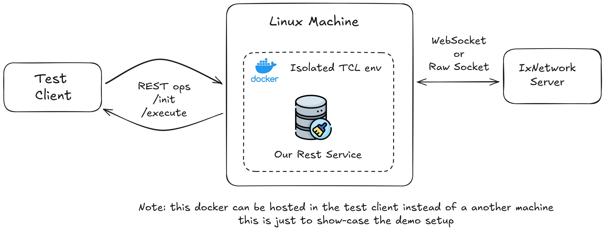

# HLT_To_HLPy_POC
**1st POC**: sample conversion of a simple HLT (**H**igh **L**evel **T**CL ) scripts to HLPy (**H**igh **L**evel **Py**thon) scripts without much change.

**2nd POC**: Ixia-specific TCL (HLT) calls from the test automation infrastructure are encapsulated in REST requests and executed in an isolated environment. This environment is a Dockerized system running IxNetwork HLT, where TCL is required only inside the container—not on the base system hosting test infrastructure.

## How to build and run the Docker for isolated TCL mode

To build the docker:

```bash
docker build -t keysight-hlt-server .
```

To run the docker:

```bash
docker run -i -d --network host keysight-hlt-server:latest
```

## How to Run

To test the POC, simply run the configuration file:

```bash
python cfg.py
```

### Testing Different Execution Paths

`cfg.py` accepts a command-line argument to select the execution module. The flag is `-impl` or `--implementation` and defaults to `tcl`.

Examples:

- Default (Tcl/HLT):
```bash
python cfg.py
# or explicitly
python cfg.py --implementation tcl
```

- Python (HLPy):
```bash
python cfg.py --implementation python
```

- Isolated Tcl/HLT:
```bash
python cfg.py --implementation isolated_tcl
```

### Example Output (Tcl/HLT Mode)

When running with `implementation="tcl"`, the output shows HLT running in the background:

```
python3 ./cfg.py
% package require Ixia
Tcl 8.6 is installed on 64bit architecture.
Using products based on HLTSET289
IxTclHal is not be used for current HLTSET.
Loaded IxTclNetwork 26.0.2601.6
Loaded Mpexpr 1.2
HLT release 26.0.2601.5
Loaded ixia_hl_lib-26.0 


% ::ixia::connect -ixnetwork_tcl_server 10.74.45.143:8009 -device xgshs-606488.ccu.is.keysight.com -port_list {2/1 2/2} -break_locks 1 -reset 1
Connecting to IxNetwork Tcl Server 10.74.45.143 -port 8009 -clientId {HLAPI-Tcl} ...
WARNING: IxNetwork Tcl library version 26.0.2601.6 is not matching the IxNetwork client version 10.00.2312.4
result =  {port_handle {{10 {{39 {{51 {{204 {{2/1 1/2/1} {2/2 1/2/2}}}}}}}}} {xgshs-606488 {{ccu {{is {{keysight {{com {{2/1 1/2/1} {2/2 1/2/2}}}}}}}}}}}}} {connection {{tcl_port 8009} {using_tcl_proxy 0} {server_version 10.00.2312.4} {port 8009} {chassis {{xgshs-606488 {{ccu {{is {{keysight {{com {{hostname xgshs-606488.ccu.is.keysight.com} {ip {}} {chassis_protocols_version Ignored} {chassis_type {Ixia XGS2}} {chassis_version {IxOS 10.00.1000.17 Patch3}} {is_master_chassis 1} {chain_type daisy} {chassis_chain {{sequence_id 1}}}}}}}}}}}}}}} {client_version 26.0.2601.6} {username IxNetwork/1N14170253/vhowdhur} {hostname 1N14170253} {license {{server localhost} {type aggregation}}}}} {vport_list {1/2/1 1/2/2}} {vport_protocols_handle {::ixNet::OBJ-/vport:1/protocols ::ixNet::OBJ-/vport:2/protocols}} {guardrail_messages {{1 {WARNING: IxNetwork main module errors - Ignore Version Registry Key is Enabled.}} {2 {MESSAGE: StatViewer Guardrail Info - The statistics Guard Rail option is designed to protect you from adding too many statistics. It is recommended to keep this option enabled, in order to prevent inaccurate statistics while running large scale tests.}}}} {status 1}


% ::ixia::traffic_config -mode create -traffic_generator ixnetwork -circuit_type raw -name HL-L2 -endpointset_count 1 -emulation_src_handle {1/2/1} -emulation_dst_handle {1/2/2} -src_dest_mesh one_to_one -route_mesh one_to_one -bidirectional 1 -rate_percent 10 -frame_size 512
result =  {status 1} {log {}} {stream_id TI0-HL-L2} {traffic_item ::ixNet::OBJ-/traffic/trafficItem:1/configElement:1} {::ixNet::OBJ-/traffic/trafficItem:1/configElement:1 {{headers {::ixNet::OBJ-/traffic/trafficItem:1/configElement:1/stack:"ethernet-1" ::ixNet::OBJ-/traffic/trafficItem:1/configElement:1/stack:"fcs-2"}} {stream_ids ::ixNet::OBJ-/traffic/trafficItem:1/highLevelStream:1} {::ixNet::OBJ-/traffic/trafficItem:1/highLevelStream:1 {{headers {::ixNet::OBJ-/traffic/trafficItem:1/highLevelStream:1/stack:"ethernet-1" ::ixNet::OBJ-/traffic/trafficItem:1/highLevelStream:1/stack:"fcs-2"}}}} {endpoint_set_id 1} {encapsulation_name Ethernet}}}
```

### Example Output (Python/HLPy Mode)

When running with `implementation="python"`, the output shows HLPy running with Python dictionaries:

```
python3 ./cfg.py -impl python 
ixiatcl:info: Tcl version: 8.6.12
/opt/ixia/ixnetwork/26.0.2601.6/lib/TclApi/ /opt/ixia/hlapi/26.0.2601.5/ /usr/share/tcltk/tcl8.6 /usr/share/tcltk /usr/lib /usr/local/lib/tcltk /usr/local/share/tcltk /usr/lib/tcltk/x86_64-linux-gnu /usr/lib/tcltk /usr/lib/tcltk/tcl8.6
Tcl 8.6 is installed on 64bit architecture.
Using products based on HLTSET289
IxTclHal is not be used for current HLTSET.
Loaded IxTclNetwork 26.0.2601.6
Loaded Mpexpr 1.2
HLT release 26.0.2601.5
Loaded ixia_hl_lib-26.0 


Executing command: ::ixia::connect with arguments: -ixnetwork_tcl_server 10.74.45.143:8009 -device xgshs-606488.ccu.is.keysight.com -port_list {2/1 2/2} -break_locks 1 -reset 1
Resolved namespace: ixia, function: connect
Parsed arguments: {'ixnetwork_tcl_server': '10.74.45.143:8009', 'device': 'xgshs-606488.ccu.is.keysight.com', 'port_list': ['2/1', '2/2'], 'break_locks': 1, 'reset': 1}
Connecting to IxNetwork Tcl Server 10.74.45.143 -port 8009 -clientId {HLAPI-Tcl} ...
WARNING: IxNetwork Tcl library version 26.0.2601.6 is not matching the IxNetwork client version 10.00.2312.4
result =  {'port_handle': {'10': {'39': {'51': {'204': {'2/1': '1/2/1', '2/2': '1/2/2'}}}}, 'xgshs-606488': {'ccu': {'is': {'keysight': {'com': {'2/1': '1/2/1', '2/2': '1/2/2'}}}}}}, 'connection': {'tcl_port': '8009', 'using_tcl_proxy': '0', 'server_version': '10.00.2312.4', 'port': '8009', 'chassis': {'xgshs-606488': {'ccu': {'is': {'keysight': {'com': {'hostname': 'xgshs-606488.ccu.is.keysight.com', 'ip': '', 'chassis_protocols_version': 'Ignored', 'chassis_type': 'Ixia XGS2', 'chassis_version': 'IxOS 10.00.1000.17 Patch3', 'is_master_chassis': '1', 'chain_type': 'daisy', 'chassis_chain': {'sequence_id': '1'}}}}}}}, 'client_version': '26.0.2601.6', 'username': 'IxNetwork/1N14170253/vhowdhur', 'hostname': '1N14170253', 'license': {'server': 'localhost', 'type': 'aggregation'}}, 'vport_list': '1/2/1 1/2/2', 'vport_protocols_handle': '::ixNet::OBJ-/vport:1/protocols ::ixNet::OBJ-/vport:2/protocols', 'guardrail_messages': {'1': 'WARNING: IxNetwork main module errors - Ignore Version Registry Key is Enabled.', '2': 'MESSAGE: StatViewer Guardrail Info - The statistics Guard Rail option is designed to protect you from adding too many statistics. It is recommended to keep this option enabled, in order to prevent inaccurate statistics while running large scale tests.'}, 'status': '1'}


Executing command: ::ixia::traffic_config with arguments: -mode create -traffic_generator ixnetwork -circuit_type raw -name HL-L2 -endpointset_count 1 -emulation_src_handle {1/2/1} -emulation_dst_handle {1/2/2} -src_dest_mesh one_to_one -route_mesh one_to_one -bidirectional 1 -rate_percent 10 -frame_size 512
Resolved namespace: ixia, function: traffic_config
Parsed arguments: {'mode': 'create', 'traffic_generator': 'ixnetwork', 'circuit_type': 'raw', 'name': 'HL-L2', 'endpointset_count': 1, 'emulation_src_handle': ['1/2/1'], 'emulation_dst_handle': ['1/2/2'], 'src_dest_mesh': 'one_to_one', 'route_mesh': 'one_to_one', 'bidirectional': 1, 'rate_percent': 10, 'frame_size': 512}
result =  {'status': '1', 'log': '', 'stream_id': 'TI0-HL-L2', 'traffic_item': '::ixNet::OBJ-/traffic/trafficItem:1/configElement:1', '::ixNet::OBJ-/traffic/trafficItem:1/configElement:1': {'headers': '::ixNet::OBJ-/traffic/trafficItem:1/configElement:1/stack:"ethernet-1" ::ixNet::OBJ-/traffic/trafficItem:1/configElement:1/stack:"fcs-2"', 'stream_ids': '::ixNet::OBJ-/traffic/trafficItem:1/highLevelStream:1', '::ixNet::OBJ-/traffic/trafficItem:1/highLevelStream:1': {'headers': '::ixNet::OBJ-/traffic/trafficItem:1/highLevelStream:1/stack:"ethernet-1" ::ixNet::OBJ-/traffic/trafficItem:1/highLevelStream:1/stack:"fcs-2"'}, 'endpoint_set_id': '1', 'encapsulation_name': 'Ethernet'}}
Done
```

### Example Output (Isolated TCL/ HLT mode)



When running with `implementation="isolated_tcl"`, the output showcases commands are sent to some isolated envs which execute the commands:

```
python3 cfg.py -impl isolated_tcl    
b'{"message":"Tcl package initialized"}\n'


Sending command to remote Tcl server: ::ixia::connect -ixnetwork_tcl_server 10.39.47.41:8012 -device xgshs-606488.ccu.is.keysight.com -port_list {2/1 2/2} -break_locks 1 -reset 1 on url: http://localhost:8000//execute
result =  {port_handle {{10 {{39 {{51 {{204 {{2/1 1/2/1} {2/2 1/2/2}}}}}}}}} {xgshs-606488 {{ccu {{is {{keysight {{com {{2/1 1/2/1} {2/2 1/2/2}}}}}}}}}}}}} {connection {{tcl_port 8012} {using_tcl_proxy 0} {server_version 11.00.2504.10} {port 8012} {chassis {{xgshs-606488 {{ccu {{is {{keysight {{com {{hostname xgshs-606488.ccu.is.keysight.com} {ip 10.39.51.204} {chassis_protocols_version Ignored} {chassis_type {Ixia XGS2}} {chassis_version {IxOS 10.80.8001.21 Patch2}} {is_master_chassis 1} {chain_type daisy} {chassis_chain {{sequence_id 1}}}}}}}}}}}}}}} {client_version 26.0.2601.6} {username IxNetwork/1UAC-X0670812/ixnetwork-1348} {hostname 1UAC-X0670812} {license {{server localhost} {type aggregation}}}}} {vport_list {1/2/1 1/2/2}} {vport_protocols_handle {::ixNet::OBJ-/vport:1/protocols ::ixNet::OBJ-/vport:2/protocols}} {guardrail_messages {{1 {MESSAGE: Guardrails Monitor - IxNetwork was unable to establish a successful connection with IxMonitor service. Guard Rails resource monitoring is deactivated.}} {2 {WARNING: IxNetwork main module errors - Ignore Version Registry Key is Enabled.}} {3 {MESSAGE: StatViewer Guardrail Info - The statistics Guard Rail option is designed to protect you from adding too many statistics. It is recommended to keep this option enabled, in order to prevent inaccurate statistics while running large scale tests.}}}} {status 1}


Sending command to remote Tcl server: ::ixia::traffic_config -mode create -traffic_generator ixnetwork -circuit_type raw -name HL-L2 -endpointset_count 1 -emulation_src_handle {1/2/1} -emulation_dst_handle {1/2/2} -src_dest_mesh one_to_one -route_mesh one_to_one -bidirectional 1 -rate_percent 10 -frame_size 512 on url: http://localhost:8000//execute
result =  {status 1} {log {}} {stream_id TI0-HL-L2} {traffic_item ::ixNet::OBJ-/traffic/trafficItem:1/configElement:1} {::ixNet::OBJ-/traffic/trafficItem:1/configElement:1 {{headers {::ixNet::OBJ-/traffic/trafficItem:1/configElement:1/stack:"ethernet-1" ::ixNet::OBJ-/traffic/trafficItem:1/configElement:1/stack:"fcs-2"}} {stream_ids ::ixNet::OBJ-/traffic/trafficItem:1/highLevelStream:1} {::ixNet::OBJ-/traffic/trafficItem:1/highLevelStream:1 {{headers {::ixNet::OBJ-/traffic/trafficItem:1/highLevelStream:1/stack:"ethernet-1" ::ixNet::OBJ-/traffic/trafficItem:1/highLevelStream:1/stack:"fcs-2"}}}} {endpoint_set_id 1} {encapsulation_name Ethernet}}}
Done
```
